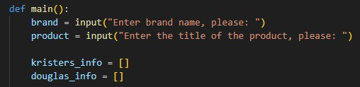

**Produktu un tās cenas meklēšanas un salīdzināšanas automatizēšanas projekts**
___

&nbsp;&nbsp;&nbsp; *Šis projekts ir paredzēts meklēšanas un salīdzināšanas procesa automatizēšanai, izmantojot Python, divos internetveikalos: Ksisters un Douglas.*

&nbsp;&nbsp;&nbsp; *Ideja par šī projekta izstrādi radās tādēļ ka kosmētiskas produkcijas cenas ir diezgan augstas, un papildus tam daudzi veikali pārspīlē cenas personīgajam labumam. Šobrīd pircējiem pašiem jāstaigā pa veikaliem, lai atrastu veikalu ar vismazāko cenu, un mūsu programma ļauj automatizēt šo procesu.*
   
___

**Projekta uzdevums:**

  &nbsp;&nbsp;&nbsp; *Šī projekta uzdevums ir ievādītas preces meklēšanas un cenu salīdzināšanas procesa automatizēšana divos kosmētikas internetvaikalos: Ksisters un Douglas. Programmatūra analizē ievadītus datus, un meklē internetveikalos ievadīto produktu un tās cenu. Pēc tam programmatūra salīdzina cenas, un izvada kurā veikalā ir lētāk un par cik eiro.*

____

**Izmantotās bibliotēkas:**

   &nbsp;&nbsp;&nbsp; *Šīs programmas izstrādē tika izmantotas šādas bibliotēkas:*
   
*-requests – tiek izmantota HTTP pieprasījumu veikšanai uz vietnēm kristers.lv  un douglas.lv, un to HTML lapu iegūšanai.*

*-BeautifulSoup (BS) – tiek izmantota informācijas par produktiem iegūšanai no lapu HTML koda.*

___

**Izmantotās datu struktūras:**

&nbsp;&nbsp;&nbsp; Programmatūrā tiek izmantotas divas struktūras: dictionary jeb vārdnīca  un list jeb saraksts. 

